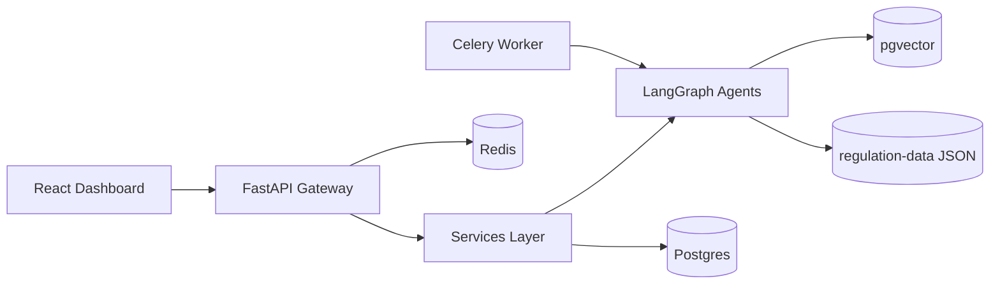

# Regula Platform

**AI-native global compliance** — upload policies, scan against 50+ regulations, get risk scores and remediation in minutes.

[](https://regula-platform-demo.run.app)
[](http://localhost:8000/docs)
[](.github/workflows/ci.yml)

> **Try before you read:** [Live demo →](https://regula-platform-demo.run.app) · [OpenAPI /docs →](http://localhost:8000/docs)

## 5-minute setup

```bash
git clone https://github.com/your-org/regula-platform.git
cd regula-platform
cp .env.example .env
make dev
```

| Service | URL |
|---------|-----|
| API + OpenAPI | http://localhost:8000/docs |
| Health check | http://localhost:8000/healthz |
| Dashboard | http://localhost:5173 |

## Why CTOs star this repo

1. **`make dev`** — Postgres, Redis, MinIO, API, worker, frontend up in one command, zero config
2. **`regulation-data/*.json`** — forkable, contributable compliance corpus (the moat)
3. **Live demo URL** — click before reading a line of code
4. **`/docs`** — FastAPI auto-generates OpenAPI; shows API maturity instantly
5. **`tests/` + MockLLM** — CI runs free, no paid API keys, proves engineering discipline

## Architecture



## Project structure

```
regula-platform/                           # Root monorepo
│
├── .env.example                           # ALL env vars with comments, safe defaults
├── .env.production                        # → GCP Secret Manager (never committed)
├── docker-compose.yml                     # FastAPI + Postgres + Redis + MinIO — one command local dev
├── docker-compose.prod.yml                # Production overrides (managed DBs, health checks)
├── Makefile                               # make dev | test | lint | migrate | deploy
├── pyproject.toml                         # Python 3.12, dep groups: base/dev/test
├── README.md                              # CTO landing page — demo link, 5-min setup, arch diagram
├── CONTRIBUTING.md                        # How to add a new country's regulation set
│
├── backend/                               # All Python — FastAPI application
│   ├── main.py                            # App factory: routers, middleware, lifespan, /healthz
│   ├── config/
│   │   ├── settings.py                    # Pydantic BaseSettings — validated at startup, fails fast
│   │   └── ai_config.py                   # LLM: Gemini Flash primary, Groq fallback, embeddings config
│   ├── api/
│   │   ├── v1/                            # Versioned — /api/v1/...
│   │   │   ├── auth.py                    # register, login, refresh, logout, /me — JWT + OAuth2
│   │   │   ├── tenants.py                 # Org onboarding, plan management, settings
│   │   │   ├── compliance.py              # scan, score, issues, resolve — the money endpoints
│   │   │   ├── documents.py               # upload (multipart), list, delete — GCP Storage
│   │   │   ├── agents.py                  # chat (SSE), async research job, job status
│   │   │   ├── regulations.py             # list, filter by country/industry, watch
│   │   │   ├── webhooks.py                # register URLs, HMAC-SHA256 signed payloads
│   │   │   └── billing.py                 # Stripe subscribe, usage, portal
│   │   └── middleware/
│   │       ├── tenant.py                  # JWT → tenant_id → request.state → DB RLS context
│   │       ├── rate_limit.py              # Sliding window via Redis, 429 + Retry-After
│   │       └── logging.py                 # Structured JSON: tenant_id, latency_ms, request_id
│   ├── services/                          # Business logic — no HTTP, fully testable
│   │   ├── auth_service.py                # bcrypt hashing, RS256 JWT, token revocation
│   │   ├── tenant_service.py              # provision schema, enforce plan limits, usage metering
│   │   ├── ingestion_service.py           # PDF→text→chunk→embed→pgvector (full async pipeline)
│   │   ├── compliance_service.py          # orchestrate scan, persist issues, calculate risk score
│   │   ├── regulation_service.py          # jurisdiction detection, regulation matching, sync
│   │   └── notification_service.py        # email (SendGrid), Slack, signed webhooks, in-app
│   ├── agents/                            # LangGraph multi-agent AI system
│   │   ├── graph.py                       # Master StateGraph: nodes + edges + conditional routing
│   │   ├── state.py                       # ComplianceAgentState TypedDict — shared across nodes
│   │   ├── research_agent.py              # Node: web_search + regulation_db → RegulationFindings
│   │   ├── analysis_agent.py              # Node: RAG over docs + regs → ComplianceIssue[] with severity
│   │   ├── draft_agent.py                 # Node: per-issue → policy patch + checklist + timeline
│   │   ├── prompts/                       # RAG system prompts (migrated from legacy ai-models/)
│   │   └── tools/
│   │       ├── rag_tool.py                # pgvector semantic search, top-k with metadata
│   │       ├── regulation_tool.py         # Structured regulation DB lookup by jurisdiction
│   │       └── web_search_tool.py         # Tavily → DuckDuckGo fallback, Redis cached
│   ├── models/                            # SQLAlchemy 2.0 ORM — async, typed
│   │   ├── base.py                        # UUID PK, created_at/updated_at, tenant_id, soft delete
│   │   ├── user.py                        # email, hashed_password, role (OWNER/ADMIN/MEMBER)
│   │   ├── tenant.py                      # plan, country, industry, scan_count, settings JSONB
│   │   ├── document.py                    # filename, storage_url, status, chunk_count
│   │   ├── compliance_issue.py            # severity, remediation, status, regulation_id FK
│   │   ├── regulation.py                  # jurisdiction, category, articles JSONB, version
│   │   └── document_chunk.py              # content + embedding Vector(768) — HNSW index on embedding
│   ├── db/
│   │   ├── session.py                     # AsyncEngine (asyncpg), get_db() dependency, RLS setter
│   │   ├── migrations/                    # Alembic — auto-generated, async env.py
│   │   └── seed.py                        # Load regulation-data/*.json → DB (idempotent)
│   ├── workers/                           # Celery async tasks — heavy jobs off request path
│   │   ├── celery_app.py                  # Redis broker, beat schedule: daily sync + weekly rescan
│   │   └── tasks/
│   │       ├── scan_task.py               # run_compliance_scan.delay() — full LangGraph pipeline
│   │       └── regulation_sync.py         # Fetch updates → diff → trigger affected tenant rescans
│   └── core/
│       ├── security.py                    # RS256 JWT, API key auth, get_current_tenant
│       ├── exceptions.py                  # Typed HTTP errors: TenantNotFound, ScanLimitExceeded, ...
│       └── schemas/                       # Pydantic v2 request/response models, separate from ORM
│           ├── auth.py                    # LoginRequest, TokenResponse, UserResponse
│           ├── compliance.py              # ScanRequest, ComplianceIssueResponse, RiskScoreResponse
│           └── agent.py                   # ChatRequest, ChatStreamChunk, AgentJobResponse
│
├── frontend/                              # React 18 + Vite + TypeScript + Tailwind + shadcn/ui
│   ├── src/
│   │   ├── pages/                         # Dashboard, DocumentUpload, AgentChat, Regulations, Settings
│   │   ├── components/                    # RiskScoreGauge, IssueCard, RegulationBadge, ScanProgress
│   │   └── lib/                           # api.ts, hooks (useComplianceScore, useScanStream, useAgent)
│   └── public/demo-data/                  # Sample docs + regulations for sandbox demo mode
│
├── regulation-data/                       # Community-maintained compliance knowledge base (JSON)
│   ├── eu/          gdpr.json, nis2.json
│   ├── global/      soc2.json, iso27001.json
│   ├── india/       companies_act_2013.json, sebi_lodr.json, dpdp_act_2023.json
│   └── us/          hipaa.json, ccpa.json
│
├── deploy/
│   ├── cloudrun/    Dockerfile, cloudbuild.yaml, service.yaml
│   ├── k8s/helm/    Helm chart — self-hosted enterprise deploy
│   └── terraform/   GCP: Cloud Run + Cloud SQL + Redis + Storage + Secrets
│
├── tests/
│   ├── conftest.py                        # async_client, test_tenant, MockLLM (free CI)
│   ├── unit/                              # service + agent tests
│   └── integration/                       # full scan pipeline (testcontainers)
│
└── .github/
    ├── workflows/ci.yml                   # PR: ruff + mypy + pytest + coverage (>80%)
    └── workflows/deploy.yml               # merge to main → Cloud Run
```

## Commands

```bash
make dev       # Start full stack
make test      # pytest + coverage (MockLLM — no API keys)
make lint      # ruff + mypy
make migrate   # Alembic upgrade head
make seed      # Load regulation-data → Postgres
make deploy    # Cloud Run via Cloud Build
```

## Immediate roadmap

1. ✅ Scaffold folder structure + `/healthz`
2. ✅ Models + Alembic init migration
3. ✅ `ingestion_service.py` — PDF → chunks → pgvector
4. ✅ `agents/graph.py` + `analysis_agent.py`
5. ✅ `api/v1/compliance.py` — scan endpoint
6. 🔲 Deploy to Cloud Run — live URL

See [CONTRIBUTING.md](CONTRIBUTING.md) to add a new country's regulation set.
